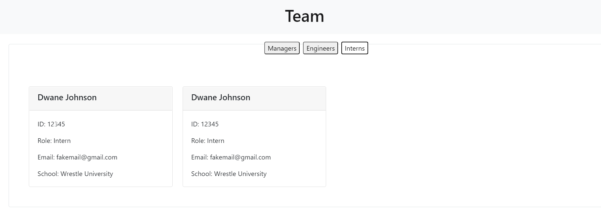

# Team Profile Generator

## What Does It Do

A Node.js command-line application that takes in information about employees on a software engineering team, then generates an HTML webpage that displays summaries for each person. Each team member must have a name, id, email, and role. Email and github provided will be clickable links on the created page

Uses Inquirer to create question prompts, and Jest for testing classes.


## Page generated

The following image shows a mock-up of the generated HTML’s appearance and functionality:



## Running the application

```bash
node index.js
```
## How to use the application

[Video Demo](https://drive.google.com/file/d/1xz16nGGpdDUzFUQshE8gvNtl_DjDRpxV/view?usp=sharing)